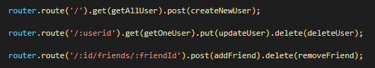

# aVerySocialAPI

## Description

This project is a sample backend of a potential social media site, utilizing MongoDB to store user information.

[Link to Live Video](https://drive.google.com/file/d/1fKOVy6r5dJq7ojo_ALoYxHYHm5NS8hmn/view)

---

Here's a few quick links:

* [Installation and Usage](#Installation-and-Usage)
* [Code Snippets](#code-snippets)
* [Technology used](#technology-used)
* [learning Points](#learning-points)
* [License](#license)
* [Author](#author)
---

## Installation and Usage

1. Navigate to the [GitHub Repository](https://github.com/fiaschettima/aVerySocialAPI) 
2. Clone the Repository to your computer
3. In terminal navigate to the cloned Repository
`
cd aVerySocialAPI
`
4. After navigatiing to the file in terminal enter the command:
`
npm start
`
5. The API routes will all be useable at this point on Local Host 3001
 
---

## Code Snippets

This snippet of code shows modularization of the API routes. Having all the GET, PUT, POST and delete actions seperate from the routes themselves.

---

## Technology Used
    
    JS
    MONGO db
    express
    mongoose

---

## Learning Points
    
    This project provided experience using mongo db in conjunction with mongoose to create databases.

---

## License

    MIT License
---
## Author
    
    Matthew Fiaschetti 
[Github Profile](https://github.com/fiaschettima)
